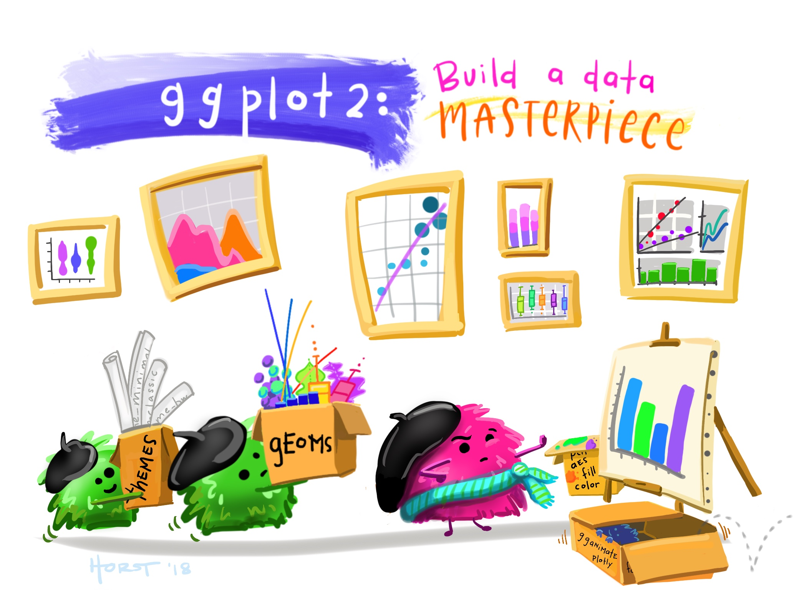
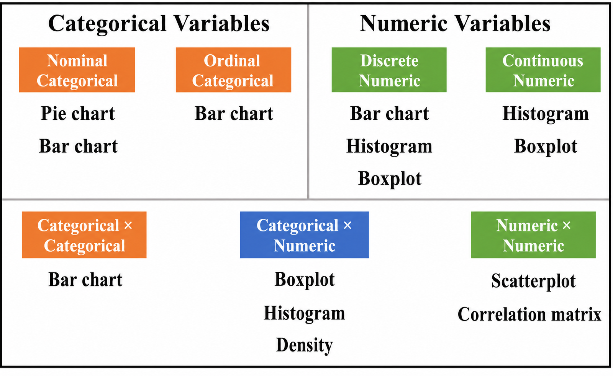

[View the Quarto source](https://github.com/lucastoshioito/tutorial_ggplot2/blob/main/index.qmd)

```{r}
#| label: setup
#| include: false

library(ggplot2)       # data visualization
library(dplyr)         # data manipulation
library(RColorBrewer)  # color palettes
library(ggdist)        # raincloud plots
library(Hmisc)         # correlation matrices
library(ggcorrplot)    # correlation heatmaps
library(plotly)        # interactive graphics

knitr::opts_chunk$set(
  out.width = "100%",
  fig.showtext = TRUE,
  retina = 1
)
```

# Why visualize data?

Data visualization makes patterns, unusual observations, and relationships easier to identify than they are in a table alone. The **ggplot2** package implements the *Grammar of Graphics*: a plot is assembled from data, aesthetic mappings, geometric objects, scales, and a theme.

{fig-alt="A colorful illustration of ggplot2 as a collection of visual layers used to build a data masterpiece." width="85%" fig-align="center"}

This tutorial covers:

- bar and pie charts;
- histograms, boxplots, and density plots;
- scatterplots and correlation matrices;
- layered and interactive graphics.

# The structure of a ggplot

A basic ggplot needs three elements:

1. **Data**: a data frame.
2. **Aesthetics**: variables mapped with `aes()`, such as `x`, `y`, `color`, or `fill`.
3. **Geometry**: the visual representation, such as points, bars, or boxes.

Scales, labels, facets, and themes can then refine the plot.

```{r}
#| eval: false

ggplot(data = data_frame, aes(x = variable_1, y = variable_2)) +
  geom_point()
```

# Colors in R

R includes many named [colors](http://www.stat.columbia.edu/~tzheng/files/Rcolor.pdf). Packages such as **RColorBrewer** provide coordinated palettes for categorical, sequential, and diverging data.

```{r}
#| eval: false

display.brewer.all()
```

{fig-alt="A grid of sequential, qualitative, and diverging RColorBrewer palettes." width="72%" fig-align="center"}

For more options, see the [R color palette collection](https://emilhvitfeldt.github.io/r-color-palettes/discrete.html), including palettes designed with color-vision accessibility in mind.

# Example dataset

The examples use [`surto.xlsx`](surto.xlsx), a teaching dataset based on a foodborne illness investigation. In November 2018, 200 people attended a symposium. Of the 150 participants who ate lunch at the venue, 50 became ill. A case was defined as vomiting and/or diarrhea after eating at least one item served at the event.

The objective is to explore the participants, symptoms, laboratory measurements, and possible exposures through clear graphics.

```{r}
outbreak <- readxl::read_excel("surto.xlsx", sheet = "Plan1") |>
  transmute(
    case = factor(caso, labels = c("No", "Yes")),
    sex = factor(sexo, labels = c("Female", "Male")),
    occupation = factor(
      ocupa,
      levels = c("enfermeiro", "estudante", "medico", "professor", "tecnico"),
      labels = c("Nurse", "Student", "Physician", "Professor", "Technician")
    ),
    severity = factor(
      gravidade,
      ordered = TRUE,
      labels = c("Mild", "Moderate", "Severe")
    ),
    drank_water = factor(agua, labels = c("No", "Yes")),
    hemoglobin = hb,
    leukocytes = leuco,
    triglycerides = tgl
  )

dplyr::glimpse(outbreak)
```

# Choosing a chart

{fig-alt="Guide matching categorical and numeric variable combinations to bar charts, histograms, boxplots, density plots, scatterplots, and correlation matrices." width="100%" fig-align="center"}

# Bar charts

Bar charts display counts or proportions for categorical variables.

## One variable

```{r}
# A minimal count plot
ggplot(outbreak, aes(x = occupation)) +
  geom_bar()
```

```{r}
# A styled count plot
ggplot(outbreak, aes(x = occupation, fill = occupation)) +
  geom_bar(show.legend = FALSE) +
  scale_fill_brewer(palette = "Set1") +
  labs(
    title = "Participants by occupation",
    x = "Occupation",
    y = "Count"
  ) +
  theme_minimal()
```

```{r}
# Relative frequencies
ggplot(outbreak, aes(x = occupation)) +
  geom_bar(aes(y = after_stat(count / sum(count))), fill = "steelblue") +
  scale_y_continuous(labels = scales::percent) +
  labs(
    title = "Distribution of occupations",
    x = "Occupation",
    y = "Percentage"
  ) +
  theme_minimal()
```

## Two variables

```{r}
ggplot(outbreak, aes(x = occupation, fill = sex)) +
  geom_bar(position = "fill") +
  scale_y_continuous(labels = scales::percent) +
  scale_fill_brewer(palette = "Set1") +
  labs(
    title = "Sex distribution within occupations",
    x = "Occupation",
    y = "Percentage",
    fill = "Sex"
  ) +
  theme_minimal()
```

## Three variables with facets

```{r}
ggplot(outbreak, aes(x = case, fill = drank_water)) +
  geom_bar(position = "fill") +
  facet_wrap(~sex) +
  scale_y_continuous(labels = scales::percent) +
  scale_fill_manual(values = c("cornflowerblue", "dodgerblue4")) +
  labs(
    title = "Foodborne illness and water consumption",
    subtitle = "Results are shown separately by sex",
    x = "Foodborne illness case",
    y = "Percentage",
    fill = "Drank water?"
  ) +
  theme_bw()
```

# Pie charts

Pie charts use angle and area, which are harder to compare precisely than aligned bars. Use them sparingly and only when the number of categories is small.

```{r}
ggplot(outbreak, aes(x = "", fill = case)) +
  geom_bar(width = 1) +
  coord_polar(theta = "y") +
  scale_fill_brewer(palette = "Set1") +
  labs(
    title = "Foodborne illness cases",
    x = NULL,
    y = NULL,
    fill = "Case"
  ) +
  theme_void()
```

# Histograms

Histograms divide a continuous variable into bins. The bin width can strongly affect the apparent shape, so examine more than one reasonable value.

## One variable

```{r}
ggplot(outbreak, aes(x = hemoglobin)) +
  geom_histogram(bins = 40, fill = "midnightblue", color = "white") +
  labs(
    title = "Distribution of hemoglobin",
    x = "Hemoglobin (g/dL)",
    y = "Count"
  ) +
  theme_minimal()
```

## Two variables

```{r}
ggplot(outbreak, aes(x = hemoglobin, fill = sex)) +
  geom_histogram(bins = 40, color = "white", alpha = 0.75) +
  scale_fill_brewer(palette = "Set1") +
  labs(
    title = "Hemoglobin distribution by sex",
    x = "Hemoglobin (g/dL)",
    y = "Count",
    fill = "Sex"
  ) +
  theme_minimal()
```

## Three variables with facets

```{r}
ggplot(outbreak, aes(x = hemoglobin, fill = sex)) +
  geom_histogram(bins = 30, color = "white") +
  facet_wrap(~case) +
  scale_fill_brewer(palette = "Set1") +
  labs(
    title = "Hemoglobin by sex and case status",
    x = "Hemoglobin (g/dL)",
    y = "Count",
    fill = "Sex"
  ) +
  theme_bw()
```

# Boxplots

Boxplots summarize a continuous distribution through its median, quartiles, spread, and potential outliers.

## One variable

```{r}
ggplot(outbreak, aes(y = leukocytes)) +
  geom_boxplot(fill = "lightgreen", color = "darkgreen") +
  labs(
    title = "Distribution of leukocyte counts",
    x = NULL,
    y = "Leukocytes (µL)"
  ) +
  theme_minimal()
```

## Two variables

```{r}
ggplot(outbreak, aes(x = occupation, y = leukocytes, color = occupation)) +
  geom_boxplot(show.legend = FALSE) +
  scale_color_brewer(palette = "Set1") +
  labs(
    title = "Leukocyte counts by occupation",
    x = "Occupation",
    y = "Leukocytes (µL)"
  ) +
  theme_minimal()
```

## Three variables with facets

```{r}
ggplot(outbreak, aes(x = case, y = leukocytes, color = case)) +
  geom_boxplot(show.legend = FALSE) +
  facet_wrap(~occupation) +
  scale_color_brewer(palette = "Set1") +
  labs(
    title = "Leukocyte counts by case status and occupation",
    x = "Foodborne illness case",
    y = "Leukocytes (µL)"
  ) +
  theme_bw()
```

# Density plots

Density plots estimate a smooth distribution. They are useful for comparing shapes, but the smoothing bandwidth should be chosen carefully.

## One variable

```{r}
ggplot(outbreak, aes(x = hemoglobin)) +
  geom_density(fill = "firebrick3", color = "white", alpha = 0.8) +
  geom_vline(
    xintercept = mean(outbreak$hemoglobin, na.rm = TRUE),
    color = "black",
    linetype = "dashed"
  ) +
  labs(
    title = "Density of hemoglobin values",
    x = "Hemoglobin (g/dL)",
    y = "Density"
  ) +
  theme_minimal()
```

## Two variables

```{r}
ggplot(outbreak, aes(x = hemoglobin, fill = case)) +
  geom_density(color = "white", alpha = 0.5) +
  scale_fill_brewer(palette = "Set1") +
  labs(
    title = "Hemoglobin density by case status",
    x = "Hemoglobin (g/dL)",
    y = "Density",
    fill = "Case"
  ) +
  theme_minimal()
```

## Three variables with facets

```{r}
ggplot(outbreak, aes(x = hemoglobin, fill = case)) +
  geom_density(color = "white", alpha = 0.5) +
  facet_wrap(~sex) +
  scale_fill_brewer(palette = "Set1") +
  labs(
    title = "Hemoglobin density by case status and sex",
    x = "Hemoglobin (g/dL)",
    y = "Density",
    fill = "Case"
  ) +
  theme_bw()
```

# Scatterplots

Scatterplots show the relationship between two continuous variables. Color, shape, or facets can add a third variable.

## Two variables

```{r}
ggplot(outbreak, aes(x = hemoglobin, y = leukocytes)) +
  geom_point(color = "cyan4") +
  geom_smooth(method = "lm", se = FALSE, color = "dodgerblue4") +
  labs(
    title = "Hemoglobin and leukocyte counts",
    x = "Hemoglobin (g/dL)",
    y = "Leukocytes (µL)"
  ) +
  theme_minimal()
```

## Three variables

```{r}
ggplot(outbreak, aes(x = hemoglobin, y = leukocytes, color = sex)) +
  geom_point() +
  geom_smooth(method = "lm", se = FALSE) +
  scale_color_manual(values = c("dodgerblue4", "darkgoldenrod2")) +
  labs(
    title = "Hemoglobin and leukocyte counts by sex",
    x = "Hemoglobin (g/dL)",
    y = "Leukocytes (µL)",
    color = "Sex"
  ) +
  theme_minimal()
```

# Correlation matrix

```{r}
# Calculate Pearson correlations and p-values for numeric variables.
correlation <- Hmisc::rcorr(
  as.matrix(outbreak[c("hemoglobin", "leukocytes", "triglycerides")]),
  type = "pearson"
)
correlation$P[is.na(correlation$P)] <- 0

ggcorrplot::ggcorrplot(
  correlation$r,
  lab = TRUE,
  lab_size = 5,
  digits = 2,
  colors = c("blueviolet", "white", "firebrick"),
  legend.title = "Pearson\ncorrelation",
  p.mat = correlation$P
) +
  labs(title = "Correlation matrix", subtitle = "Pearson correlations")
```

# Layered graphics

## Histogram and density curve

```{r}
case_means <- outbreak |>
  group_by(case) |>
  summarise(mean_leukocytes = mean(leukocytes, na.rm = TRUE), .groups = "drop")

ggplot(outbreak, aes(x = leukocytes, fill = case)) +
  geom_histogram(
    aes(y = after_stat(density)),
    alpha = 0.45,
    position = "identity",
    color = "black"
  ) +
  geom_density(alpha = 0.25) +
  geom_vline(
    data = case_means,
    aes(xintercept = mean_leukocytes, color = case),
    linetype = "dashed",
    show.legend = FALSE
  ) +
  scale_fill_brewer(palette = "Set1") +
  labs(
    title = "Leukocyte distributions by case status",
    x = "Leukocytes (µL)",
    y = "Density",
    fill = "Case"
  ) +
  theme_minimal()
```

## Raincloud plot

A raincloud plot combines a density estimate, a boxplot, and individual observations.

```{r}
outbreak |>
  filter(case == "Yes", !is.na(severity)) |>
  ggplot(aes(x = severity, y = leukocytes, color = severity)) +
  ggdist::stat_halfeye(
    aes(fill = severity),
    alpha = 0.4,
    show.legend = FALSE,
    adjust = 0.5,
    width = 0.6,
    .width = 0,
    justification = -0.3
  ) +
  geom_boxplot(width = 0.25) +
  geom_jitter(alpha = 0.6, width = 0.1) +
  scale_color_brewer(palette = "Set1") +
  scale_fill_brewer(palette = "Set1") +
  labs(
    title = "Leukocyte counts by illness severity",
    x = "Severity",
    y = "Leukocytes (µL)",
    color = "Severity"
  ) +
  theme_minimal()
```

# Interactive graphics with Plotly

`ggplotly()` converts a ggplot into an interactive graphic with tooltips, zooming, and panning. Some styling may change during conversion.

```{r}
#| label: interactive-boxplot

interactive_boxplot <- ggplot(
  outbreak,
  aes(x = occupation, y = leukocytes, color = occupation)
) +
  geom_boxplot(show.legend = FALSE) +
  scale_color_brewer(palette = "Set1") +
  labs(
    title = "Leukocyte counts by occupation",
    x = "Occupation",
    y = "Leukocytes (µL)"
  ) +
  theme_minimal()

plotly::ggplotly(interactive_boxplot)
```

```{r}
#| label: interactive-scatterplot

interactive_scatterplot <- ggplot(
  outbreak,
  aes(x = hemoglobin, y = leukocytes, color = sex)
) +
  geom_point() +
  geom_smooth(method = "lm", se = FALSE) +
  scale_color_manual(values = c("dodgerblue4", "darkgoldenrod2")) +
  labs(
    title = "Hemoglobin and leukocyte counts by sex",
    x = "Hemoglobin (g/dL)",
    y = "Leukocytes (µL)",
    color = "Sex"
  ) +
  theme_minimal()

plotly::ggplotly(interactive_scatterplot)
```

# Further resources

## Galleries

- [Tanya Shapiro's visualization gallery](https://tanyaviz.com/)
- [Cédric Scherer's data visualization portfolio](https://www.cedricscherer.com/top/dataviz/)
- [The R Graph Gallery](https://r-graph-gallery.com/)
- [From Data to Viz](https://www.data-to-viz.com/)

## Tutorials and documentation

- [A ggplot2 tutorial for beautiful plotting in R](https://www.cedricscherer.com/2019/08/05/a-ggplot2-tutorial-for-beautiful-plotting-in-r/)
- [Allison Horst's data visualization materials](https://allisonhorst.github.io/rice-data-viz/)
- [Official ggplot2 reference](https://ggplot2.tidyverse.org/reference/)
- [ggplot2 cheat sheet](https://posit.co/resources/cheatsheets/)

# Exercises

1. Filter the dataset to foodborne illness cases. Create a bar chart of illness severity, fill the bars by sex, and identify the most common severity level.
2. Create a histogram of triglyceride values using 50 bins.
3. Filter to foodborne illness cases and create boxplots of leukocyte counts by illness severity. Which severity level has the highest median?
4. Create a scatterplot of leukocyte and triglyceride values. Is there evidence of a positive, negative, or absent association?
5. Choose two variables not paired in the examples above. Create an appropriate plot and describe what it reveals.
